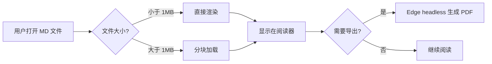
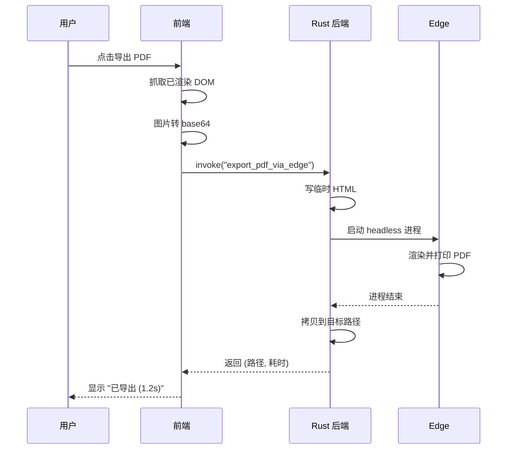
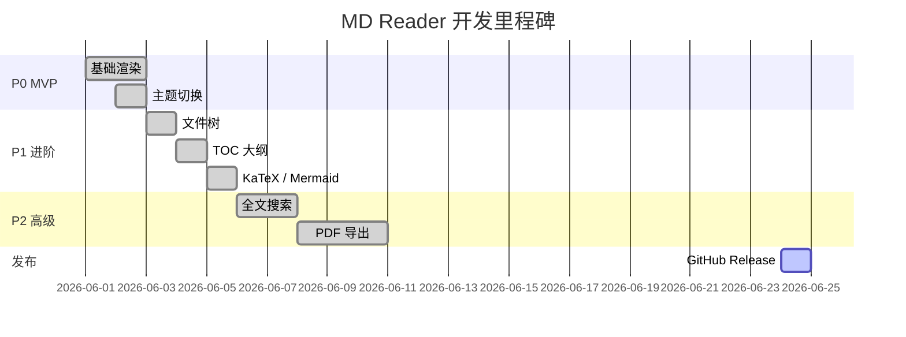
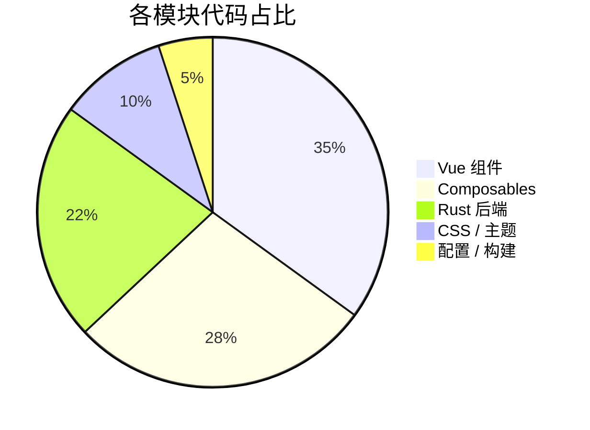

# MD Reader 功能演示

> 这是一个展示 MD Reader 全部渲染能力的示例文档。所有元素均为真实渲染效果，可用于截图展示。

## 一、文本与排版

**粗体** · *斜体* · ***粗斜体*** · ~~删除线~~ · `行内代码` · <u>下划线</u> · H~2~O · E=mc^2^

> 引用块：所谓伊人，在水一方。
>
> 嵌套引用：
> > 道生一，一生二，二生三，三生万物。

---

## 二、列表

### 无序列表

- 第一项
  - 嵌套第一项
  - 嵌套第二项
    - 深层嵌套
- 第二项
- 第三项

### 有序列表

1. 启动 MD Reader
2. 打开 Markdown 文件
3. 享受所见即所得的阅读体验

### 任务列表

- [x] 实现 Markdown 基础渲染
- [x] 集成 KaTeX 数学公式
- [x] 集成 Mermaid 图表
- [x] PDF / DOCX / HTML 导出
- [ ] macOS / Linux 支持
- [ ] 自定义 CSS 主题

---

## 三、数学公式（KaTeX）

### 行内公式

爱因斯坦质能方程：$E = mc^2$，欧拉恒等式：$e^{i\pi} + 1 = 0$。

二次方程的解：$x = \dfrac{-b \pm \sqrt{b^2 - 4ac}}{2a}$。

### 块级公式

**高斯积分**：

$$
\int_{-\infty}^{+\infty} e^{-x^2} \, dx = \sqrt{\pi}
$$

**麦克斯韦方程组**：

$$
\begin{aligned}
\nabla \cdot \mathbf{E} &= \frac{\rho}{\varepsilon_0} \\
\nabla \cdot \mathbf{B} &= 0 \\
\nabla \times \mathbf{E} &= -\frac{\partial \mathbf{B}}{\partial t} \\
\nabla \times \mathbf{B} &= \mu_0 \mathbf{J} + \mu_0 \varepsilon_0 \frac{\partial \mathbf{E}}{\partial t}
\end{aligned}
$$

**傅里叶变换**：

$$
\hat{f}(\xi) = \int_{-\infty}^{\infty} f(x)\, e^{-2\pi i x \xi}\, dx
$$

**矩阵**：

$$
\mathbf{A} = \begin{pmatrix}
a_{11} & a_{12} & a_{13} \\
a_{21} & a_{22} & a_{23} \\
a_{31} & a_{32} & a_{33}
\end{pmatrix}
$$

---

## 四、流程图（Mermaid）

### 流程图



### 时序图



### 甘特图



### 饼图



---

## 五、代码块（语法高亮）

### Rust

```rust
#[tauri::command]
fn export_pdf_via_edge(
    opts: PdfExportOptions,
) -> Result<PdfExportResult, PdfExportError> {
    let edge = find_edge_executable(opts.edge_path.as_deref())
        .ok_or_else(|| PdfExportError::NoEdge("未找到 Edge".into()))?;

    let start = std::time::Instant::now();
    let mut cmd = Command::new(&edge);
    cmd.arg("--headless=new")
       .arg("--disable-gpu")
       .arg(format!("--print-to-pdf={}", temp_pdf.display()));

    let output = cmd.output()?;
    let elapsed_ms = start.elapsed().as_millis() as u64;

    Ok(PdfExportResult {
        out_path: opts.out_path,
        elapsed_ms,
        edge_path: edge.to_string_lossy().to_string(),
    })
}
```

### TypeScript

```typescript
export async function exportToPdf(
  body: HTMLElement,
  baseName: string,
  title: string,
  onPickEdge: () => Promise<string | null>
): Promise<PdfExportResult | null> {
  const dest = await save({
    defaultPath: baseName + ".pdf",
    filters: [{ name: "PDF", extensions: ["pdf"] }],
  });
  if (!dest) return null;

  const html = await buildExportHtml(body, title, { forceLight: true });
  return await invoke<PdfExportResult>("export_pdf_via_edge", {
    opts: { html, outPath: dest },
  });
}
```

### Vue

```vue
<script setup lang="ts">
import { ref, computed } from "vue";
import { renderMarkdown } from "../composables/useMarkdown";

const props = defineProps<{ source: string }>();
const html = computed(() => renderMarkdown(props.source));
</script>

<template>
  <article class="markdown-body" v-html="html" />
</template>
```

### Python

```python
def fibonacci(n: int) -> int:
    """返回斐波那契数列第 n 项"""
    if n < 2:
        return n
    a, b = 0, 1
    for _ in range(n - 1):
        a, b = b, a + b
    return b

print([fibonacci(i) for i in range(10)])
# [0, 1, 1, 2, 3, 5, 8, 13, 21, 34]
```

### Shell

```bash
# 构建 MD Reader
pnpm install
pnpm tauri build --bundles msi

# 安装 pandoc（用于 DOCX 导出）
winget install --id JohnMacFarlane.Pandoc -e
```

---

## 六、表格

### 基础表格

| 工具 | 体积 | 启动时间 | 内存占用 | 价格 |
|---|---:|---:|---:|---:|
| MD Reader | **5.6 MB** | **0.3 s** | **80 MB** | **免费** |
| Typora | 80 MB | 2.0 s | 200 MB | 89 元 |
| Obsidian | 200 MB | 3.0 s | 400 MB | 免费 |
| VS Code | 350 MB | 2.5 s | 300 MB | 免费 |

### 对齐演示

| 左对齐 | 居中 | 右对齐 |
|:---|:---:|---:|
| Apple | 1.00 | $1.20 |
| Banana | 12 | $0.50 |
| Cherry | 100 | $5.99 |

---

## 七、链接与图片

- 项目主页：[github.com/Neilooo/md-reader](https://github.com/Neilooo/md-reader)
- 下载地址：[最新版本](https://github.com/Neilooo/md-reader/releases/latest)
- 内部链接（同目录其它 md 文件）：`[使用文档](./USAGE.md)` 会自动跳转
- 锚点链接：[跳到第一节](#一文本与排版)

---

## 八、引用与脚注

牛顿在《自然哲学的数学原理》中提出了三大运动定律[^newton]，
这奠定了经典力学的基础。爱因斯坦的相对论[^einstein]进一步扩展了这一框架。

[^newton]: Newton, I. (1687). *Philosophiæ Naturalis Principia Mathematica*.
[^einstein]: Einstein, A. (1915). *Die Feldgleichungen der Gravitation*.

---

## 九、键盘按键与提示

按 <kbd>Ctrl</kbd> + <kbd>F</kbd> 唤起当前文档查找。
按 <kbd>Ctrl</kbd> + <kbd>Shift</kbd> + <kbd>F</kbd> 跨文件全文搜索。
按 <kbd>Ctrl</kbd> + <kbd>P</kbd> 调出打印 / 另存为 PDF。

---

## 十、Emoji 🎨

🚀 快速启动 · 📝 实时渲染 · 🔍 全文搜索 · 📤 多格式导出 · 🎨 亮暗主题 · 🌐 跨平台潜力

:smile: :rocket: :star: :heart: :fire: :tada: :sparkles:

---

## 十一、分隔与水平线

上面与下面之间用三个连字符分隔。

---

## 结语

如果你觉得这个项目还不错，请到 [GitHub 仓库](https://github.com/Neilooo/md-reader) 给一个 ⭐ Star，这是对作者最大的支持！

> "Make it work, make it right, make it fast." — Kent Beck

$$
\boxed{\text{Thanks for reading!}}
$$
